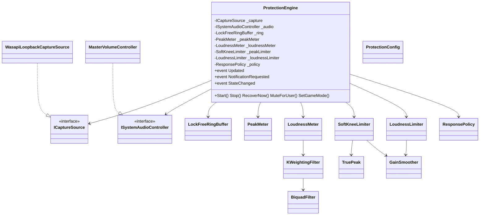

# SoundGuard 架构设计

## 1. 总体分层

```
┌─────────────────────────────────────────────────────────────┐
│                     SoundGuard.App (WPF)                     │
│  MainWindow · MainViewModel · VerticalMeter · TrayIconService│
│  AppController（组合根：接线 UI ↔ 引擎）                        │
└──────────────────────────┬──────────────────────────────────┘
                           │ 事件（已封送到 UI 线程）
┌──────────────────────────▼──────────────────────────────────┐
│                    SoundGuard.Core.Engine                    │
│  ProtectionEngine（捕获→分析线程→策略→动作）                    │
│  ResponsePolicy（纯函数，可单测）                              │
│  ProtectionConfig / AnalysisResult / ProtectionDecision       │
└──────┬───────────────┬──────────────────┬───────────────────┘
       │               │                  │
┌──────▼──────┐ ┌──────▼──────┐   ┌───────▼────────┐
│ Core.Audio  │ │ Core.Dsp    │   │ Core.System    │
│ 捕获 + 环形   │ │ 峰值/真实峰值 │   │ 主音量/静音      │
│ 缓冲区       │ │ K加权/LUFS   │   │ 独占/全屏/前台   │
│             │ │ 双限幅器     │   │ 进程检测         │
└─────────────┘ └─────────────┘   └────────────────┘
```

- **Core** 不依赖任何 UI，可被测试项目直接引用。
- **App** 只负责展示与交互，不包含任何 DSP 逻辑。
- 唯一外部依赖：**NAudio**（MIT）——`WasapiLoopbackCapture`（捕获）与 `MMDevice/AudioEndpointVolume`
  （音量/静音）。如需换成 C++/WASAPI 原生实现，只需替换 `ICaptureSource` 与 `ISystemAudioController`
  两个接口的实现。

## 2. 核心接口

```csharp
// 捕获后端抽象（可换 WASAPI / 虚拟设备 / APO）
public interface ICaptureSource : IDisposable
{
    AudioFormat Format { get; }
    event Action<float[], int>? DataAvailable;   // (interleaved float[], frames)
    void Start();
    void Stop();
}

// 系统音频控制抽象（引擎依赖此接口，便于测试）
public interface ISystemAudioController : IDisposable
{
    bool IsMuted { get; }
    float VolumeDb { get; }
    void SetMuted(bool muted);
    void SetVolumeDb(float db);
}
```

## 3. 类图



## 4. 线程模型与数据流

```
  [WASAPI 捕获线程]                [分析线程]                    [UI 线程]
        │                              │                            │
        │ DataAvailable(float[], n)    │                            │
        ▼                              │                            │
  LockFreeRingBuffer.TryWrite ──(无锁 SPSC)──▶ Read(block)          │
        │                              ▼                            │
        │                     PeakMeter / LoudnessMeter             │
        │                     SoftKneeLimiter / LoudnessLimiter     │
        │                              │                            │
        │                     ResponsePolicy.Evaluate              │
        │                              ▼                            │
        │                     Execute(Attenuate/Mute/Recover)       │
        │                     ISystemAudioController                │
        │                              │                            │
        │                     AnalysisResult ──▶ Dispatcher.BeginInvoke
        │                                                  ▼
        │                                            ViewModel.Apply
        │                                                  ▼
        │                                            WPF 绑定刷新
```

关键点：

1. **捕获回调只做一次拷贝**（`TryWrite`），绝不阻塞在分析上——NAudio 复用缓冲区，必须立即复制。
2. **环形缓冲区是 SPSC 无锁的**：生产者只写 `_writePos`，消费者只写 `_readPos`，用 `Volatile`
   发布/读取头尾指针，无 CAS、无锁、无 GC 分配（预分配 `float[]`）。
3. **分析线程**以约 5ms 块读取，块大小在构造时由采样率决定，保证阶段 A 的“5ms 检测窗口”。
4. **UI 事件在分析线程触发**，由 `AppController` 通过 `Dispatcher.BeginInvoke` 封送到 UI 线程。
5. 所有大块缓冲区（环形缓冲、分析块、前视延迟线、LUFS 累加器）均为**预分配**，运行期零分配，
   避免 GC 压力与 LOH 抖动。

## 5. 保护动作执行（分级响应）

`ResponsePolicy.Evaluate` 是纯函数，输入测量值、输出 `ProtectionDecision`：

| 条件 | 状态 | 动作 |
|---|---|---|
| 直通 | Bypass | 无（继续测量，用于对比） |
| 真实峰值 &gt; 危险阈值 持续 100ms | Muted | 系统静音 + 托盘气泡通知 |
| 峰值或响度超标 | Limiting | 按 `max(peakGR, loudnessGR)` 降低主音量（封顶 20dB） |
| 恢复条件满足（信号安全 + ≥10s） | Safe | 取消静音、恢复基线音量 |
| 其它 | Safe | 无动作 |

- **阶段 A 始终优先**：组合增益取 `max(peakGR, loudnessGR)`，瞬态峰值必然压过慢速响度。
- **轻微/严重分级**：响度超标 ≤3 LU 为“渐进式”（响度限幅器，attack 150ms），&gt;3 LU 或峰值阶段
  触发为“快速压限”（峰值限幅器，attack &lt;1ms）。

## 6. 主音量衰减（共享模式代理）

```text
baselineVolumeDb = 当前主音量（首次需要衰减时记录）
targetDb         = baselineVolumeDb - gainReductionDb（封底 -60 dB）
恢复              = 写回 baselineVolumeDb
```

音量变化有硬件/APO 惯性，因此子毫秒级精度不重要；该机制是共享模式下唯一能在“输出端”真正保护
听力的手段。信号路径内、零延迟的处理属于 APO/虚拟设备（里程碑 4）。
